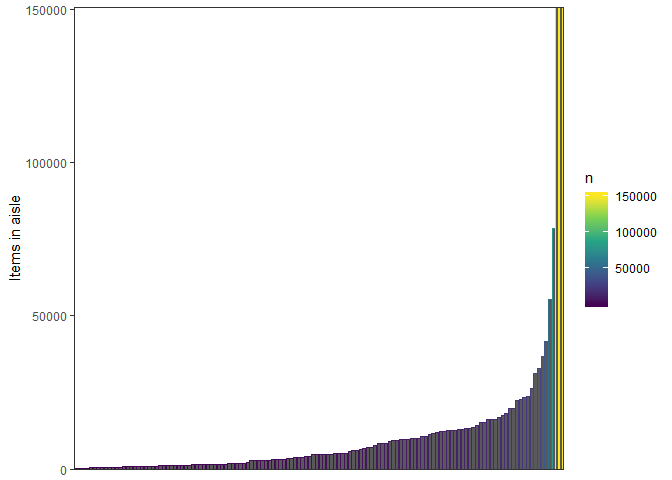

HW3
================
James Dalgleish
October 9, 2018

First, we'll begin by importing the dataset, cleaning the names to be more appropriate, and focusing on the Overall Health topic (by filtering for this topic only in the BRFSS responses). Responses are filtered to only include the 5 ordinal categories, Excellent, Very Good, Good, Fair, Poor.

``` r
brfss <- p8105.datasets::brfss_smart2010 %>% #Pulls dataframe out of package.
  janitor::clean_names() %>%  #Converts to snake case.
  filter(topic == "Overall Health",
         response %in% c("Excellent","Very Good", "Good", "Fair", "Poor")) %>%     #Filters by overall health topic.
  mutate(response = factor(response,levels = c("Excellent","Very Good", "Good", "Fair", "Poor")))
```

Problem 2

``` r
instacart <- p8105.datasets::instacart %>% #Pulls dataframe out of package.
  janitor::clean_names() #cleans names
```

``` r
distinct_aisles <- instacart %>%
  group_by(aisle) %>% 
  summarize(count = n()) %>% 
  arrange(
    desc(count)
  )
```

There appear to be 134 aisles. The aisles with the most are displayed in the table below:

``` r
distinct_aisles %>% 
  head() %>% 
  kable()
```

| aisle                         |   count|
|:------------------------------|-------:|
| fresh vegetables              |  150609|
| fresh fruits                  |  150473|
| packaged vegetables fruits    |   78493|
| yogurt                        |   55240|
| packaged cheese               |   41699|
| water seltzer sparkling water |   36617|

The numbers of items in each aisle can be visualized with the following plot:

``` r
items_by_aisle <- instacart %>%
  group_by(aisle) %>% 
count() %>% 
  arrange(
    desc(n)
    ) %>%
as.data.frame() %>% #makes the grouping variable modifyable 
  as.tibble() %>%  #factor reorder.
  mutate(aisle = forcats::fct_reorder(aisle, n))


items_by_aisle %>% 
  ggplot(aes(x = aisle,y = n,color = n)) + #establishes mappings.
  geom_col() + #like geom_bar, but takes a variable for height.
  scale_color_viridis_c() + #adds color
  scale_y_continuous(expand=c(0,0)) + #removes whitespace at bottom.
   theme_bw() +
  theme(axis.title.x = element_blank(), #removes panel grid at back.
        axis.text.x = element_blank(),
        axis.ticks.x = element_blank(),
        panel.grid.major = element_blank(),
        panel.grid.minor = element_blank()) +
  ylab("Items in aisle") +
  xlab("aisles, sorted by number of items")
```


