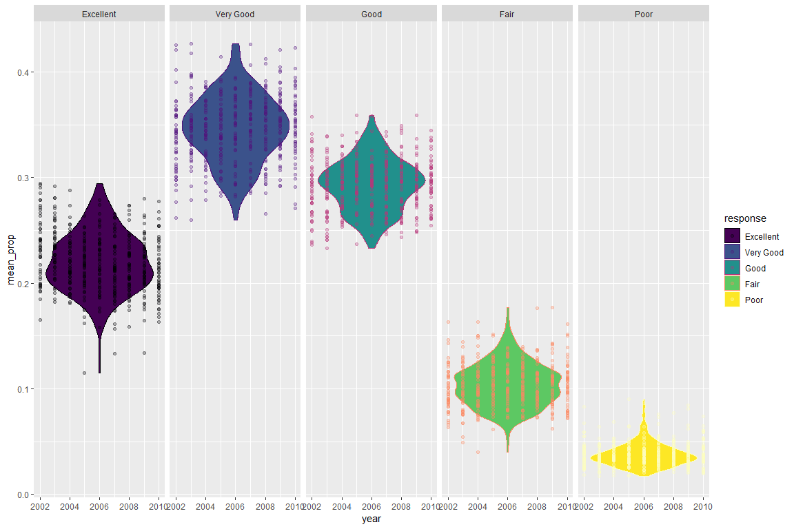
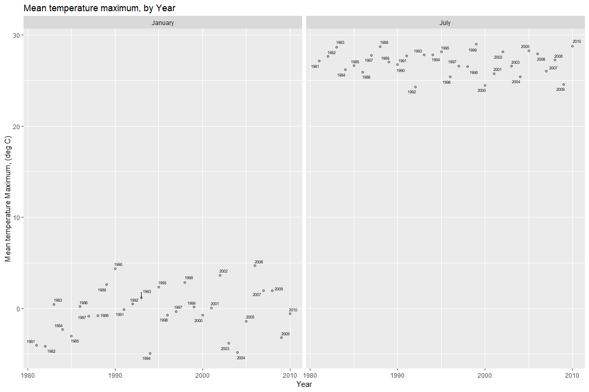
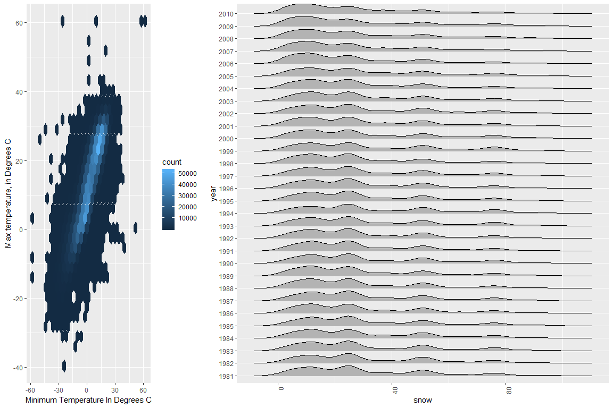

HW3
================
James Dalgleish
October 9, 2018

First, we'll begin by importing the dataset, cleaning the names to be more appropriate, and focusing on the Overall Health topic (by filtering for this topic only in the BRFSS responses). Responses are filtered to only include the 5 ordinal categories, Excellent, Very good, Good, Fair, Poor.

``` r
brfss <- p8105.datasets::brfss_smart2010 %>% #Pulls dataframe out of package.
  janitor::clean_names() %>%  #Converts to snake case.
  filter(topic == "Overall Health",
         response %in% c("Excellent","Very good", "Good", "Fair", "Poor")) %>%     #Filters by overall health topic.
  mutate(response = recode(response,"Very good" = "Very Good")) %>% 
  mutate(response = factor(response,levels = c("Excellent","Very Good", "Good", "Fair", "Poor")))
n_7 <- brfss %>% 
  filter(year == 2002) %>% 
  group_by(locationabbr) %>% 
count(locationabbr) %>% 
  arrange(-n) %>% 
filter(n == 7)
```

"In 2002, which states were observed at 7 locations?"" Clearly, from the table, were observed at exactly 7 locations. had observations at exactly 7 locations in any year. Make a “spaghetti plot” that shows the number of locations in each state from 2002 to 2010."

``` r
spaghetti <- brfss %>% 
  filter(year >= 2002 & year <= 2010) %>%
  group_by(locationabbr,year) %>% 
  summarise(n = n()) %>% 
  ggplot(aes(x = year, y = n, color = locationabbr)) +
  geom_line() + 
  scale_color_viridis_d(option = "viridis") +
  labs(x = "Year",y = "Number of locations in each State",
       color = "State",
       title = "Number of locations in each state, by year, 2002-2010") +
  theme_dark()
  #+ geom_text(aes(x=locationabbr)) 
print(spaghetti)
```


"Make a table showing, for the years 2002, 2006, and 2010, the mean and standard deviation of the proportion of “Excellent” responses across locations in NY State." The proportion of the response (in percent) is located in the data\_value column, filtering by 2002,2006,2010, for NY and for Excellent responses only. The proportion therefore can be obtained by dividing by 100, from which point the mean and sd can be taken as summary statistics after grouping.

``` r
statewide_ex_stats <- brfss %>% 
  filter(year %in% c(2002,2006,2010),
         locationabbr == "NY",response=="Excellent") %>%
  group_by(locationabbr,year) %>% 
  summarize(ex_sd_prop = 
  sd(data_value/100),
  ex_mean_prop = mean(data_value/100))  %>% 
    select(year,locationabbr,ex_sd_prop,ex_mean_prop)
statewide_ex_stats
```

A tibble: 3 x 4
===============

Groups: locationabbr \[1\]
==========================

year locationabbr ex\_sd\_prop ex\_mean\_prop <int> <chr> <dbl> <dbl> 1 2002 NY 0.0449 0.240 2 2006 NY 0.0400 0.225 3 2010 NY 0.0357 0.227

"For each year and state, compute the average proportion in each response category (taking the average across locations in a state). Make a five-panel plot that shows, for each response category separately, the distribution of these state-level averages over time."

``` r
brfss %>% 
  group_by(locationabbr,response,year) %>%
    summarize(sd_prop = 
  sd(data_value/100,na.rm = T),
  mean_prop = mean(data_value/100,na.rm = T)) %>% 
  ggplot(aes(x=year,y=mean_prop,facet=response,color=response,fill=response)) +
  geom_violin() + geom_point(alpha = 0.3) +
  scale_color_viridis_d(option = "magma") +
  scale_fill_viridis_d(option = "viridis") +
  facet_grid(.~response)
```



Problem 2
=========

``` r
instacart <- p8105.datasets::instacart %>% #Pulls dataframe out of package.
  janitor::clean_names() #cleans names
```

``` r
distinct_aisles <- instacart %>%
  group_by(aisle) %>% 
  summarize(count = n()) %>% 
  arrange(
    desc(count)
  )
```

There appear to be 134 aisles. The aisles with the most are displayed in the table below with their counts:

``` r
distinct_aisles %>% 
  head() %>% 
  kable()
```

| aisle                         |   count|
|:------------------------------|-------:|
| fresh vegetables              |  150609|
| fresh fruits                  |  150473|
| packaged vegetables fruits    |   78493|
| yogurt                        |   55240|
| packaged cheese               |   41699|
| water seltzer sparkling water |   36617|

``` r
distinct_aisles %>% pull(aisle) %>% .[1]
```

    ## [1] "fresh vegetables"

The numbers of items in each aisle can be visualized with the following plot. The number of aisles is 134, making it difficult to label all of the data (although key data is properly labeled in the table above). The previous table shows that fresh vegetables and fresh fruits are the outliers near 15000, with packaged vegetables fruits at roughly half the magnitude. The top 5 items are labeled, matching the prior table.

``` r
items_by_aisle <- instacart %>%
  group_by(aisle) %>% 
count() %>% 
  arrange(
    desc(n)
    ) %>%
as.data.frame() %>% #makes the grouping variable modifyable 
  as.tibble() %>%  #factor reorder.
  mutate(aisle = forcats::fct_reorder(aisle, n))

library(ggrepel)
items_by_aisle %>% 
  ggplot(aes(x = aisle,y = n,fill = n)) + #establishes mappings.
  geom_col() + #like geom_bar, but takes a variable for height.
#  scale_fill_viridis_c() +
  scale_fill_viridis_c() + #adds color
  scale_y_continuous(expand = c(0,0)) + #removes whitespace at bottom.
  #scale_x_discrete(breaks=levels(items_by_aisle$aisle)[c(130,134)]) + #labels=items_by_aisle$aisle[c(130,134)],
   theme_bw() +
  geom_text_repel(data = items_by_aisle %>% head(n=5),aes(label = aisle,color = NULL)) +
  theme(#axis.title.x = element_blank(), #removes panel grid at back.
        axis.text.x = element_blank(),
        axis.ticks.x = element_blank(),
        panel.grid.major = element_blank(),
        panel.grid.minor = element_blank()) +
  labs(x = "aisles, sorted by number of items",
         y = "Items in aisle",
       fill = "Items in aisle",
       title = "Sorted Instacart Items by Aisle")
```


Now, we'll create a table with the most popular items in the aisles for baking ingredients, dog food care, and packaged vegetables/fruits.

``` r
instacart %>% 
  filter(aisle
         %in% c("baking ingredients","dog food care","packaged vegetables fruits")) %>% 
  group_by(aisle) %>% 
count(product_name) %>% 
  filter(n == max(n)) %>%
  arrange(
    desc(n)
  ) %>% 
  select(product_name,n,everything())
```

    ## # A tibble: 3 x 3
    ## # Groups:   aisle [3]
    ##   product_name                                   n aisle                  
    ##   <chr>                                      <int> <chr>                  
    ## 1 Organic Baby Spinach                        9784 packaged vegetables fr~
    ## 2 Light Brown Sugar                            499 baking ingredients     
    ## 3 Snack Sticks Chicken & Rice Recipe Dog Tr~    30 dog food care

Instruction"Make a table showing the mean hour of the day at which Pink Lady Apples and Coffee Ice Cream are ordered on each day of the week; format this table for human readers (i.e. produce a 2 x 7 table)." Now, we'll show the mean hour of the day at which the items are ordered.

``` r
pink_ice_tbl<-instacart %>% 
  filter(product_name %in% c("Pink Lady Apples","Coffee Ice Cream")) %>% 
  group_by(product_name,order_dow) %>% 
  summarize(mean_hour=mean(order_hour_of_day)) %>% 
  spread(key=product_name,value=,mean_hour) %>% 
mutate(order_dow = recode(.$order_dow,"0" = "Sunday",
                             "1" = "Monday",
                             "2" = "Tuesday",
                             "3" = "Wednesday",
                             "4" = "Thursday",
                             "5" = "Friday",
                             "6" = "Saturday")) %>% 
  janitor::clean_names() %>% 
  select(order_dow,
         coffee_ice_cream,
         pink_lady_apples)
pink_ice_tbl
```

    ## # A tibble: 7 x 3
    ##   order_dow coffee_ice_cream pink_lady_apples
    ##   <chr>                <dbl>            <dbl>
    ## 1 Sunday                13.8             13.4
    ## 2 Monday                14.3             11.4
    ## 3 Tuesday               15.4             11.7
    ## 4 Wednesday             15.3             14.2
    ## 5 Thursday              15.2             11.6
    ## 6 Friday                12.3             12.8
    ## 7 Saturday              13.8             11.9

Problem 3
=========

``` r
noaa <- p8105.datasets::ny_noaa %>% 
  as.tibble() %>% 
  janitor::clean_names()
```

"The goal is to do some exploration of this dataset. To that end, write a short description of the dataset, noting the size and structure of the data, describing some key variables, and indicating the extent to which missing data is an issue. Then, do or answer the following (commenting on the results of each):" This NOAA dataset for the new york area from 747 stations has 2595176 rows and 7 columns, which columns include total daily precipitation (prcp), miminum temperature, maximum temperature, snowfall,snowdepth at each station.

``` r
prop.na<-function(x){
   is.na(x) %>% mean()
}
sapply(noaa,  prop.na)
```

    ##        id      date      prcp      snow      snwd      tmax      tmin 
    ## 0.0000000 0.0000000 0.0561958 0.1468960 0.2280331 0.4371025 0.4371264

A quick look across the column shows that there is significant missing data (which aligns with the missing data reported in the dataset description,<http://p8105.com/dataset_noaa.html>), almost half of the data in the maximum temperature and minimum temperature are missing. The cause of this is also detailed in the description, specifically that each station can only record some of the datapoints in the dataset (and the datapoints that a particular station cannot record are missing). From documentation (<https://www1.ncdc.noaa.gov/pub/data/ghcn/daily/readme.txt>), we also note that the temperatures are in tenths of a degree celcius, we'll correct for this by dividing by 10. Precipitation is in tenths of a milimeter, while snofall is in mm. We'll also correct this by dividing by 10.

Instruction: "Do some data cleaning. Create separate variables for year, month, and day. Ensure observations for temperature, precipitation, and snowfall are given in reasonable units. For snowfall, what are the most commonly observed values? Why? Make a two-panel plot showing the average max temperature in January and in July in each station across years. Is there any observable / interpretable structure? Any outliers?"

``` r
noaa_clean <- p8105.datasets::ny_noaa %>% 
  as.tibble() %>% 
  janitor::clean_names() %>% 
mutate(day = lubridate::day(noaa$date),
       month = lubridate::month(noaa$date),
       year = lubridate::year(noaa$date),
       tmax = as.numeric(tmax)/10,
       tmin = as.numeric(tmin)/10,
       prcp = as.numeric(prcp)/10,
       snow = as.numeric(snow),
       snwd = as.numeric(snwd)) 
#most common values for snowfall
common_snow_vals <- noaa_clean %>% 
  count(snow) %>% 
  arrange(-n)
common_vals_string <- common_snow_vals %>%
  pull(snow) %>%
  head() %>%
  paste(sep = ',')
```

The five most common values include: 0, NA, 25, 13, 51, 76. The reason for the large amount of snowfall missing is due to the fact that stations only record a subset of the variables and the reason there are are many days with zero is likely because there are many days in the year in new york with zero snowfall (particularly in the summer, spring and fall months).

``` r
mtmax_plot_d<-noaa_clean %>% 
  filter(month %in% c(1,7)) %>%
  mutate(month = recode(month, "1" = "January", "7" = "July")) %>% 
  group_by(year,month) %>%
  summarize(mean_tmax = mean(tmax,na.rm = TRUE)) %>% 
  arrange(-mean_tmax)
  ggplot(data=mtmax_plot_d,aes(x=year,y=mean_tmax,facet=month)) +
    geom_point(alpha = 0.3) + 
  geom_text_repel(#data=head(mtmax_plot_d,n=2),
    aes(label = year
                       # paste(year,format(mean_tmax,digits=3),sep=",") 
           ), size = 2) +
  facet_grid(.~month) +
  labs(x = "Year",y = "Mean temperature")
```



``` r
# noaa_clean %>% 
#   filter(month %in% c(1,7)) %>%
#   mutate(month = recode(month, "1" = "January", "7" = "July")) %>% 
#   group_by(year,month) %>%
#   ggplot(aes(x=year,y=tmax,facet=month,z=mean(tmax))) +
#     stat_summary_hex(fun = mean) +
#   facet_grid(.~month) +
#   labs(x="Year",y="Mean temperature")
```

Observable structure: There appears to be an increasing variability over time in the January temperatures with a definite outlier at 1990. There was a year that was one of the most cold on record the year before (another outlier). The july temperatures appear to be fairly regular with the exception of 1993. Outliers: 1990 for January (high). 2009 for July (low). 1992 for July (low). 2006 for January (high).

"Make a two-panel plot showing (i) tmax vs tmin for the full dataset (note that a scatterplot may not be the best option); and (ii) make a plot showing the distribution of snowfall values greater than 0 and less than 100 separately by year."

``` r
library(patchwork)
tmaxmin_hex <- noaa_clean %>% 
  ggplot(aes(x=tmax,y=tmin)) + geom_hex()
snow_year_dist <- noaa_clean %>% 
  filter(snow > 0 & snow < 100) %>% 
    ggplot(aes(x=as.factor(year),y=snow,color=year,fill=year)) +
  geom_violin() +
  scale_color_viridis_c() +
    scale_fill_viridis_c() +
  theme(axis.text.x = element_text(angle = 90, hjust = 1))
tmaxmin_hex + snow_year_dist
```

    ## Warning: Removed 1136276 rows containing non-finite values (stat_binhex).


